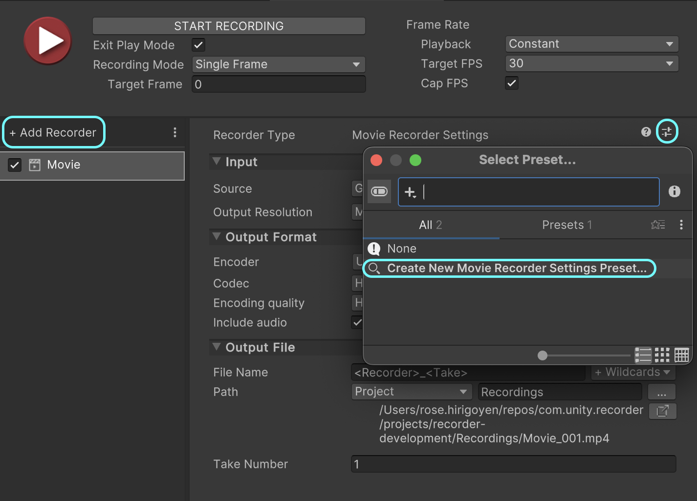

# Launch recordings from the command line

Set up your Unity project to launch recordings from the command line. Use this setup to enable batch recording via a job queue of many command lines targeting different recordings.

## Overview

This tutorial provides an example solution for recording from the command line using API scripting and Recorder Setting Presets.

1. [Create Recorder Settings Presets](#create-recorder-settings-presets).
2. [Set up your project to be able to record via a script](#set-up-a-recording-script).
3. [Write a function to trigger a recording](#create-a-function-to-trigger-recordings).
4. [Call the recording function from the command line](#call-the-recording-function-from-the-command-line).
5. [Use a job queue made of command lines to enable batch recording](#batch-recording).


## Create Recorder Settings Presets

The solution suggested in this tutorial uses Recorder Settings Presets. You can prepare as many Presets as needed according to all types or variants of recording outputs you want to get. Give them unambiguous names so that you can conveniently call them later from the command line.

For example, to create an HD Movie Recorder Settings Preset:

1. Open the [Recorder window](RecordingRecorderWindow.md). Under **Add Recorder**, select or add a **Movie** recorder.

2. For **Output Resolution**, select **FHD - 1080**, which is Full HD 1920 x 1080. Adjust the rest of the properties as you wish.

3. Save the Recorder Settings as a [Preset](https://docs.unity3d.com/Manual/Presets.html): select the Preset icon  in the Recorder properties pane.

4. In the **Select preset...** window that opens, double-click on **Create New Movie Recorder Settings Preset...**.

5. Name your preset "HDMovieRecorderSettings.preset" and select **Save**.



## Set up a recording script

Set up your project to support recording through a script:

1. Create a new [MonoBehaviour](https://docs.unity3d.com/2023.3/Documentation/ScriptReference/MonoBehaviour.html) named `CommandLineRecorder` and attach it to a GameObject in your Scene. For information on how to do that, see [Creating and Using Scripts](https://docs.unity3d.com/2023.3/Documentation/Manual/CreatingAndUsingScripts.html).

2. Double-click on your new script to edit it. Replace its contents with the following code:

   ```c#
   using System;
   using System.Collections.Generic;
   using System.Linq;
   using UnityEditor;
   using UnityEditor.Presets;
   using UnityEditor.Recorder;
   using UnityEngine;
 
   public class CommandLineRecorder : MonoBehaviour
   {
       // The RecorderController starts and stops the recording.
       private RecorderController m_Controller;
 
       // The first frame to record.
       [SerializeField] private int m_startFrame;
 
       // The last frame to record.
       [SerializeField] private int m_endFrame;
 
       // The path to the Recorder Settings preset file to use for the recording.
       [SerializeField] private string m_presetPath;
   }
   ```

   In the code above, `m_startFrame`, `m_endFrame` and `m_presetPath` are serialized to ensure their values are preserved when entering PlayMode (i.e. when starting the recording).

3. Create a utility function to load and setup your Recorder Settings Preset.
   
   [!code-csharp[](CommandLineRecorder.cs#L23-L50)]

4. Create a function that starts the recording with your start frame, end frame, and Recorder Settings Preset as parameters. This function uses the [RecorderController](../api/UnityEditor.Recorder.RecorderController.html) to prepare and start the recording session.

   [!code-csharp[](CommandLineRecorder.cs#L52-L68)]

5. Use the default MonoBehaviour functions `OnEnable` and `Update` to control when your recording begins and ends. For more information about the script lifecycle, see [Order of execution for event functions](https://docs.unity3d.com/2023.3/Documentation/Manual/ExecutionOrder.html).

   - The recording starts when you enter the PlayMode (`OnEnable`).

     [!code-csharp[](CommandLineRecorder.cs#L70-L74)]

   - When the recording stops (all requested frames between start and end are recorded), Unity exits the PlayMode. This is controlled in the `Update` function.

     [!code-csharp[](CommandLineRecorder.cs#L76-L86)]

>[!NOTE]
>More examples on how to record using scripts are available as Samples provided with the Recorder Package. To import them, use the Package Manager window.

## Create a function to trigger recordings

To be able to record from the command line, you have to expose a function that you can call from outside of Unity. This function must allow you to set up the recording with specific parameters, enter playMode, and start the recording.

1. Create a utility function to parse the command line arguments required to set up and start a recording.

   [!code-csharp[](CommandLineRecorder.cs#L88-L110)]

2. Create another utility function to ease the process of setting up the MonoBehaviour variables: `startFrame`, `endFrame` and `presetPath`.

   [!code-csharp[](CommandLineRecorder.cs#L112-L118)]

3. Add the `ExecuteCommandLine` function to be called from the command line. This function starts the recording with the correct settings.

   [!code-csharp[](CommandLineRecorder.cs#L120-L146)]

Now, your `CommandLineRecorder` should look [like this](CommandLineRecorderScript.md).

## Call the recording function from the command line

Now, you can call the `ExecuteCommandLine` function from the command line.

### Preparation

It is recommended to clean up your Unity project and prepare your environment:

1. Remove any Recorder from the Recorder window.
2. Close the Recorder window.
3. Save your Unity project.
4. Close your Unity project.
5. In your Command Line tool, go to the root of your Unity project: `cd <Path to the Project's root folder>`
6. Remember the path to your Recorder Settings Preset file. It should look like "Assets/HDMovieRecorderSettings.preset".

### Execute the command line

On any platform, the command line command has the following structure:

```
<Path to the Unity Executable> -projectPath <Path to the Unity project> -executeMethod <ExecuteCommandLine function> <your custom parameters>
```

For more information, see [Unity Editor command line arguments](https://docs.unity3d.com/Manual/EditorCommandLineArguments.html).

Here are examples of what a command can look like on different platforms with different Unity installations:

#### Windows

In PowerShell:
```powershell
& 'C:\Program Files\Unity\Hub\Editor\2023.2.0b4\Editor\Unity.exe' -projectPath . -executeMethod CommandLineRecorder.ExecuteCommandLine -startFrame 0 -endFrame 10 -presetPath 'Assets/HDMovieRecorderSettings.preset'
```

#### MacOS

```bash
/Applications/Unity/Hub/Editor/2023.1.10f1/Unity.app/Contents/MacOS/Unity -projectpath . -executeMethod CommandLineRecorder.ExecuteCommandLine -startFrame 0 -endFrame 10 -presetPath "Assets/HDMovieRecorderSettings.preset"
```

#### Linux

```bash
/home/<user>/Unity/Hub/Editor/2023.2.0b2/Editor/Unity -projectpath . -executeMethod CommandLineRecorder.ExecuteCommandLine -startFrame 0 -endFrame 10 -presetPath "Assets/HDMovieRecorderSettings.preset" 
```

### Expected results

When you execute the command, Unity opens and start the recording.

When the recording ends, which means Unity exits PlayMode, check the `Recordings` folder at the root of your Unity project. A new movie file must have been created, open it to see your recording.

If you get an error in the console when executing the command line (a NullRefException), verify that the `-presetPath` value is correct. You must specify it between quotes with forward slash characters only (even on Windows) and start it with "Assets" (for example: "Assets/path-to-my-preset/MyPreset.preset").

## Batch recording

At this point, you can use a batch file or a Powershell script to launch multiple recordings that may use different presets. You can also edit the script provided in this tutorial to add more parameters to further customize your recording command line.
