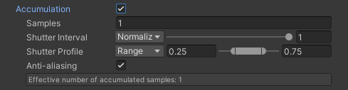

Use the properties in this section to specify the number of samples to accumulate, the interval for accumulation between subsequent frames, and the weight each sample contributes to the rendered frame.

To understand how Accumulation properties relate to each other, see [Understanding sub frame capture](RecorderAccumulationUnderstandSubFrameCapture.md).

|Property||Function|
|:---|:---|:---|
| **Samples** || The number of sub-frames to capture and accumulate between two subsequent frames.  Depending on the specified **Shutter Interval**, the **Effective number of accumulated samples** might be lower than the value you specify here. |
| **Shutter Interval** || The portion of the interval between two subsequent frames in which the Recorder actually applies the specified **Shutter Profile**.  Select **Normalized** or **Angle** according to your preferred way to specify the value.  • The maximum value applies the shutter profile to the whole interval between the two frames. • A value of 0 disables the accumulation of motion blur. If path tracing is enabled, path-tracing samples are captured for the number of sub frames defined in **Samples**. • Any value in between proportionally rescales the shutter profile and makes the shutter remain closed during the rest of the interval to the next frame.  **Note:** A longer Shutter Interval results in more motion blur. |
|  | Normalized | Lets you define a portion of the interval using a value normalized to the interval's full length (between 0 and 1). |
|  | Angle | Lets you define a portion of the interval using an angle value (between 0 and 360 degrees). |
| **Shutter Profile** || Allows you to define a custom response profile that simulates the physical motion of a camera shutter at each frame when the Recorder captures the sub-frames.  0 is a closed shutter and 1 is a fully open shutter. A fully open shutter produces the strongest image. The visibility of the image is weighted according to the degree to which the shutter is open.|
|| Range | Select this type to use a trapezoidal shutter profile. Specify two values to define the time range in which the shutter remains fully open.  • The values, between 0 and 1, are relative to the full length of the shutter profile. • The shutter opening and closing portions (from 0 to the first value, and from the second value to 1) are linear.|
|| Curve | Select this type to use a curve as the shutter profile. [Select or draw a curve](https://docs.unity3d.com/Manual/EditingCurves.html) according to your needs. |
| **Anti-aliasing** |  | Enables subpixel jitter anti-aliasing. |
| **Effective number of accumulated samples** |  | Displays the actual number of samples to be effectively accumulated from the specified number of **Samples**, according to the specified **Shutter Interval**. |
