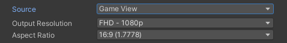

These properties appear when you set **Source** to **Game View**.

>**Note:**
>* If you have multiple Game Views in your project, the Recorder captures only the last one you selected in the Editor.
>* If you are using more than one Recorder to capture Game View, they must all use the same resolution settings.
>* If the Output Resolution and/or Aspect Ratio in the Recorder is different than the Game view resolution, the Recorder switches the Game view to the Recorder's resolution before starting the recording. After the recording ends, the Game view does not automatically revert to its previous resolution. If you need to revert this change afterward, use the **Aspect ratio** dropdown menu in the [Game view control bar](https://docs.unity3d.com/Manual/GameView.html).
>* Recording the Simulator view is [not supported](KnownIssues.md#simulator-view-recording-not-supported).

|Property||Function|
|-|-|-|
| **Output Resolution** || Allows you to set the dimensions of the recorded view using different methods. |
|   | Use Game View Resolution  | Matches the resolution and aspect ratio of the currently selected Game View. |
|   | _[PRESET RESOLUTIONS]_ | Choose from several standard video resolutions such as FHD (1080p) and 4K (2160p).  The numeric value represents the image height. To set the image width, you must select a specific **Aspect Ratio**. |
|   |  Custom | Uses custom width and height values that you supply in the **W** and **H** fields. |
| **Aspect Ratio** || Specifies the ratio of width to height (w:h) of the recorded view when you set the **Output Resolution** to a preset resolution. |
|   | _[PRESET ASPECT RATIOS]_ | Choose from several standard aspect ratios such as 16:9 (1.7778) and 4:3 (1.3333). |
|   | Custom   | Uses a custom aspect ratio that you supply in the displayed fields (w:h). |
