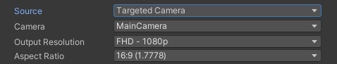

These properties appear when you set **Source** to **Targeted Camera**.

>[!NOTE]
>* If the Output Resolution and/or Aspect Ratio in the Recorder is different than the Game view resolution, the Recorder switches the Game view to the Recorder's resolution before starting the recording. After the recording ends, the Game view does not automatically revert to its previous resolution. If you need to revert this change afterward, use the **Aspect ratio** dropdown menu in the [Game view control bar](https://docs.unity3d.com/Manual/GameView.html).
>* You can't capture images from a Targeted Camera if you are using a URP 2D Renderer, due to a [known limitation](KnownIssues.md#targeted-camera-recording-is-not-available-with-urp-2d-renderer). As an alternative, you can capture from the Game View or from a Render Texture Asset.

|Property||Function|
|-|-|-|
| **Camera** ||Specifies which camera the Recorder uses to capture the recording. |
|   | ActiveCamera  | The Camera that is active when you launch the recording.  **Note:** [The ActiveCamera option is not available](KnownIssues.md#activecamera-recording-not-available-with-srps) when your project uses a Scriptable Render Pipeline (SRP). |
|   | MainCamera   | The Camera tagged with the MainCamera [Tag](https://docs.unity3d.com/Manual/Tags.html).  |
|   | TaggedCamera  | A camera tagged with a specific [Tag](https://docs.unity3d.com/Manual/Tags.html).  If you select this option, you must enter a value in the **Tag** field. |
|**Tag**   |   | Specifies which Camera Tag to look for when you set **Camera** to **Tagged Camera**.|
| **Output Resolution** || Allows you to set the dimensions of the recorded view using different methods. |
|   | Use Game View Resolution | Matches the resolution and aspect ratio of the currently selected Game View. |
|   | _[PRESET RESOLUTIONS]_ | Choose from several standard video resolutions such as FHD (1080p) and 4K (2160p).  The numeric value represents the image height. To set the image width, you must select a specific **Aspect Ratio**. |
|   |  Custom | Uses custom width and height values that you supply in the **W** and **H** fields. |
| **Aspect Ratio** || Specifies the ratio of width to height (w:h) of the recorded view when you set the **Output Resolution** to a preset resolution. |
|   | _[PRESET ASPECT RATIOS]_ | Choose from several standard aspect ratios such as 16:9 (1.7778) and 4:3 (1.3333). |
|   | Custom   | Uses a custom aspect ratio that you supply in the displayed fields (w:h). |
| **Include UI** ||Enable this option to include UI GameObjects in the recording.  This option only appears when you set **Source** to **ActiveCamera**.|
