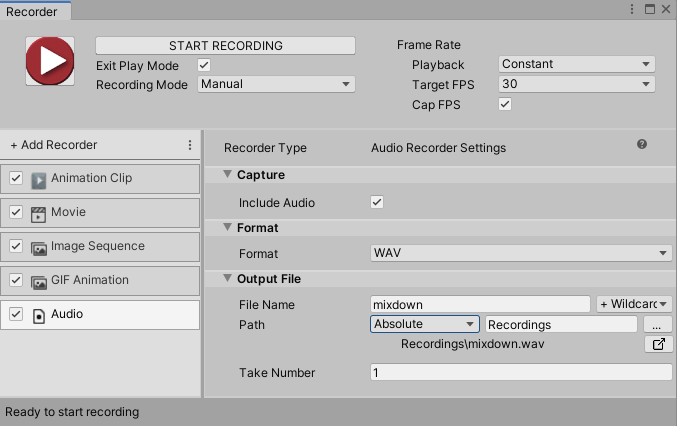

# Audio Recorder properties

The **Audio Recorder** generates an audio clip in WAV format.

This page covers all properties specific to the Audio Recorder type.

> **Note:** To fully configure any Recorder, you must also set the global [Recording Properties](Recording.md) for the capture (properties shared with the other recorders, such as the frames to record).

The Audio Recorder properties fall into three main categories:
* [Capture](#capture)
* [Format](#format)
* [Output File](#output-file)

## Capture

Use this section to define the source and the content of your recording.

|Property|Function|
|:---|:---|
| **Include Audio** | This recorder only records audio. Keep this option enabled. |

## Format

Use this section to set up the media format in which you need to save the recorded images.

|Property|Function|
|:---|:---|
| **Format** | The encoding format for Recorder output. **WAV** is the only possible option. |

## Output File

Use this section to specify the output **Path** and **File Name** pattern to save the recorded animation clip.

> **Note:** [Output File properties](RecorderProperties.md) work the same for all types of recorders.
