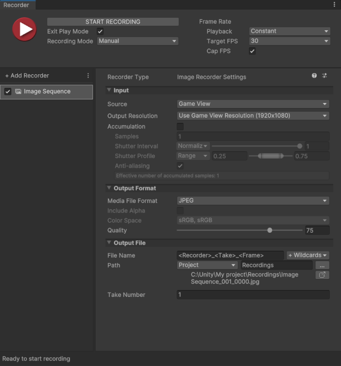

# Image Sequence Recorder properties

The **Image Sequence Recorder** generates a sequence of image files in the JPEG, PNG, or EXR (OpenEXR) file format.

This page covers all properties specific to the Image Sequence Recorder type.

> **Note:** To fully configure any Recorder, you must also set the general recording properties according to the recording interface you are using: the [Recorder window](RecorderWindowRecordingProperties.md) or a [Recorder Clip](RecordingTimelineTrack.md#recorder-clip-properties).

The Image Sequence Recorder properties fall into three main categories:
* [Input](#input)
* [Output Format](#output-format)
* [Output File](#output-file)

## Input

Use this section to define the source of your recording.

|Property||Function|
|:---|:---|:---|
| **Source** ||Specifies the input for the recording.|
|| Game View |Records frames rendered in the Game View.  Selecting this option displays the [Game View source properties](#game-view-source-properties). |
|| Targeted Camera |Records frames captured by a specific camera, even if the Game View does not use that camera.  Selecting this option displays the [Targeted Camera source properties](#targeted-camera-source-properties).|
|| 360 View |Records a 360-degree image sequence.  Selecting this option displays the [360 View source properties](#360-view-source-properties).|
|| Render Texture Asset |Records frames rendered in a Render Texture.  Selecting this option displays the [Render Texture Asset source properties](#render-texture-asset-source-properties).|
|| Texture Sampling |Supersamples the source camera during the capture to generate anti-aliased images in the recording.  Selecting this option displays the [Texture Sampling source properties](#texture-sampling-source-properties).|
| **Flip Vertical** ||When you enable this option, the Recorder flips the output image vertically. This is useful to correct for systems that output video upside down.  This option is not available when you record the Game View.|
| **Render Frame Step** || Available when you set **Playback** to **Variable**. Specifies the number of rendered frames to discard between recorded frames. Example: if the value is 2, every second frame is discarded. |
| **Accumulation** || Enable this feature to render multiple sub-frames for accumulation purposes. See [Accumulation properties](#accumulation-properties). For feature use cases and setup see [Recording Accumulation](RecordingAccumulation.md).  **Note:** Enabling the **Accumulation** feature might considerably slow down your recording process as it involves a higher amount of rendering steps.|

### Game View source properties
[!include]

### Targeted Camera source properties
[!include]

### 360 View source properties
[!include]

### Render Texture Asset source properties
[!include]

### Texture Sampling source properties
[!include]

### Accumulation properties

>[!NOTE]
>The use of the **Accumulation** feature is subject to very specific conditions:
>* Your project must use [High Definition Render Pipeline (HDRP)](https://docs.unity3d.com/Packages/com.unity.render-pipelines.high-definition@latest).
>* You can only select **Game View** or **Targeted Camera** as the **Source** for the recording.
>* You can only use one active Recorder at a time when you capture accumulation.

[!include]

## Output Format

Use this section to set up the media format you need to save the recorded images in.

|Property||Function|
|:---|:---|:---|
| **Media File Format** || The file encoding format.  Choose **PNG**, **JPEG**, or **EXR** ([OpenEXR](https://en.wikipedia.org/wiki/OpenEXR)). The Recorder encodes EXR in 16 bits. |
| **Include Alpha** || Enable this property to include the alpha channel in the recording. Disable it to only record the RGB channels.  This property is not available when the selected **Media File Format** doesn't support transparency, when the **Source** is set to **Game View**, or when Image Sequence Recorder is used as a camera input to the Universal Rendering Pipeline ([URP](https://docs.unity3d.com/Packages/com.unity.render-pipelines.universal@latest)). |
| **Color Space** | | The color space (gamma curve and gamut) to use in the output images. |
|  | sRGB, sRGB | Uses sRGB curve and sRGB primaries. |
|  | Linear, sRGB (unclamped) | Uses linear curve and sRGB primaries.  This option is only available when:  • Your project uses HDRP. • The **Source** is not Game View. The other sources can output linear unclamped sRGB. • The **Media File Format** is set to **EXR**.   **Important:** To get the expected unclamped values in the output images, you must:  • Disable any Tonemapping post-processing effects in your Scene (menu: **Edit > Project Settings > HDRP Default Settings** and deselect **Tonemapping**) and in any Volume that includes a Tonemapping override (select the Volume, navigate in the Inspector and deselect **Tonemapping** if present).  • Disable **Dithering** on the Camera selected for the capture (in the Inspector, navigate to **General** and deselect **Dithering**). |
| **Quality** | | The JPEG encoding quality level.  This property is only available when you set the **Media File Format** to **JPEG**. |
| **Compression** | | The EXR compression method to apply when saving the data.  This property is only available when you set the **Media File Format** to **EXR**. |
|  | None | Disables all compression. |
|  | Zip | Applies deflate compression to blocks of 16 scanlines at a time. This is the default selection. |
|  | RLE | Applies [Run-length encoding](https://en.wikipedia.org/wiki/Run-length_encoding) compression.  |
|  | PIZ | Applies [wavelet](https://en.wikipedia.org/wiki/Wavelet_transform#Wavelet_compression) compression. |

## Output File

Use this section to specify the output **Path** and **File Name** pattern to save the recorded image files.

> **Note:** [Output File properties](OutputFileProperties.md) work the same for all types of recorders.
