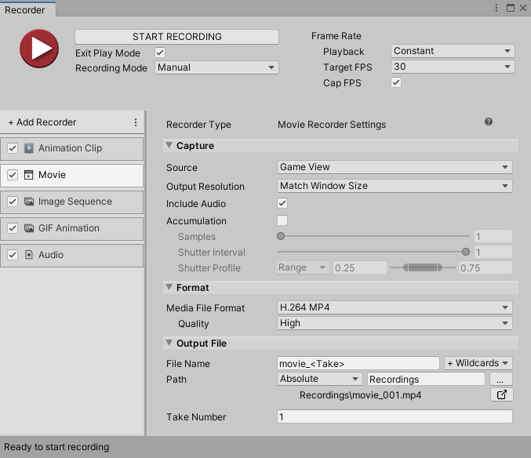

# Movie Recorder properties

The **Movie Recorder** generates videos in the H.264 MP4, VP8 WebM, or ProRes QuickTime format. Movie Recorder also generates GIF files.

This page covers all properties specific to the Movie Recorder type.

> **Note:** To fully configure any Recorder, you must also set the general recording properties according to the recording interface you are using: the [Recorder window](RecorderWindowRecordingProperties.md) or a [Recorder Clip](RecordingTimelineTrack.md#recorder-clip-properties).

The Movie Recorder properties fall into three main categories:
* [Input](#input)
* [Output Format](#output-format)
* [Output File](#output-file)

## Input

Use this section to define the source of your recording.

|Property||Function|
|:---|:---|:---|
| **Source** ||Specifies the input for the recording.|
|| Game View |Records frames rendered in the Game View.  Selecting this option displays the [Game View source properties](#game-view-source-properties). |
|| Targeted Camera |Records frames captured by a specific camera, even if the Game View does not use that camera.  Selecting this option displays the [Targeted Camera source properties](#targeted-camera-source-properties).|
|| 360 View |Records a 360-degree video.  Selecting this option displays the [360 View source properties](#360-view-source-properties).|
|| Render Texture Asset |Records frames rendered in a Render Texture.  Selecting this option displays the [Render Texture Asset source properties](#render-texture-asset-source-properties).|
|| Texture Sampling |Supersamples the source camera during the capture to generate anti-aliased images in the recording.  Selecting this option displays the [Texture Sampling source properties](#texture-sampling-source-properties).|
| **Flip Vertical** ||When you enable this option, the Recorder flips the output image vertically. This is useful to correct for systems that output video upside down.  This option is not available when you record the Game View.|
| **Render Frame Step** || Available when you set **Playback** to **Variable**. Specifies the number of rendered frames to discard between recorded frames. The duration of the discarded frames is preserved, reducing frames per second. Example: if the value is 2, every second frame is discarded, but the duration of the recording remains the same. |
| **Accumulation** || Available if your project uses [HDRP (High Definition Render Pipeline)](https://docs.unity3d.com/Packages/com.unity.render-pipelines.high-definition@latest).  Enable this feature to render [multiple sub-frames](https://docs.unity3d.com/Packages/com.unity.render-pipelines.high-definition@10.3/manual/Accumulation.html) for accumulation purposes.  See [Accumulation properties](#accumulation-properties) below.  For set up and use cases, see [Recording Accumulation](RecordingAccumulation.md).  **Note:** Enabling the **Accumulation** feature might slow down your recording process considerably as it involves more rendering steps.|

### Game View source properties
[!include]

### Targeted Camera source properties
[!include]

### 360 View source properties
[!include]

### Render Texture Asset source properties
[!include]

### Texture Sampling source properties
[!include]

### Accumulation properties

>[!NOTE]
>The use of the **Accumulation** feature is subject to very specific conditions:
>* Your project must use [High Definition Render Pipeline (HDRP)](https://docs.unity3d.com/Packages/com.unity.render-pipelines.high-definition@latest).
>* You can only select **Game View** or **Targeted Camera** as the **Source** for the recording.
>* You can only use one active Recorder at a time when you capture accumulation.

[!include]

## Output Format

Use this section to set up the media format you need to save the recorded images in.

|Property|Function|
|:---|:---|
| **Encoder** | The encoder to use for the recording. Each encoder has a specific set of properties: • Select [Unity Media Encoder](#unity-media-encoder-properties) to generate an H.264 MP4 or VP8 WebM video. • Select [GIF Encoder](#gif-encoder-properties) to generate an animated GIF. • Select [ProRes Encoder](#prores-encoder-properties) to generate a video file encoded with an Apple ProRes codec.  **Note:** To integrate a custom command line encoder such as FFmpeg and make it available from this list, use the [**Custom Encoder: FFmpeg**](samples-custom-encoder.md) sample provided along with the Recorder package. |
| **Include Audio** | Enable this option to include audio in the recording when the **Encoder** supports it. The Unity Media Encoder supports Mono or Stereo audio recording. The ProRes encoder supports Stereo only.  To enable recording when Include Audio is selected, in **Project Settings** > **Audio** > **Default Speaker Mode**, ensure that  **Mono**, or **Stereo** is selected.  **Note:** If you include audio, during recording, the audio signal is sent to the Recorder, not to your system's audio output. |
| **Include Alpha** | Enable this property to include the alpha channel in the recording. Disable it to only record the RGB channels.  This property is not available when the selected **Codec** doesn't support transparency, when the **Source** is set to **Game View**, or when Movie Recorder is used as a camera input to the Universal Rendering Pipeline ([URP](https://docs.unity3d.com/Packages/com.unity.render-pipelines.universal@latest)). |

### Unity Media Encoder properties

| Property | Function |
|:---|:---|
| **Codec** | The video codec to use to encode the output file.  The **Unity Media Encoder** includes **H.264 MP4** and **VP8 WebM** codecs.  **Note:** Encoding with H.264 MP4 codec is not supported on Linux. |
| **Encoding quality** | The quality of the output movie: **Low**, **Medium**, or **High**. The lower the quality, the smaller the file size.  Select **Custom** to set up specific quality properties. |
| **Target Bitrate** | Custom value for the bitrate the encoder tries to average throughout the video, in Mbps. |
| **GOP Size** or **Keyframe Distance** | Custom value for the interval between two full images ([I-frames](https://en.wikipedia.org/wiki/Video_compression_picture_types)). |
| **Encoding Profile** (H.264 MP4 only) | Custom encoding profile: choose **H.264 Baseline**, **H.264 Main**, or **H.264 High**. Each [encoding profile](https://en.wikipedia.org/wiki/Advanced_Video_Coding#Profiles) defines a different set of capabilities and constraints on which decoders rely. |
| **B-Frames** (H.264 MP4 only) | Custom value for the number of bidirectional predicted frames ([B-frames](https://en.wikipedia.org/wiki/Video_compression_picture_types)). |

>**Tip:** See Youtube's [Recommended upload encoding settings](https://support.google.com/youtube/answer/1722171?hl=en#zippy=%2Ccontainer-mp%2Cvideo-codec-h%2Cframe-rate%2Cbitrate) for H.264 MP4.

### GIF Encoder properties

| Property | Function |
|:---|:---|
| **Quality** | The encoding quality of the GIF file. A higher quality results in a larger file size. |
| **Loop** | Makes the generated file loop the frame sequence indefinitely. |

### ProRes Encoder properties

| Property | Function |
|:---|:---|
| **Codec** | The video codec to use to encode the output file.  The **ProRes Encoder** includes a variety of [Apple ProRes](https://en.wikipedia.org/wiki/Apple_ProRes) codecs: **ProRes 4444 XQ**, **ProRes 4444**, **ProRes 422 HQ**, **ProRes 422**, **ProRes 422 LT** or **ProRes 422 Proxy**.  **Notes:** <ul><li>Encoding with ProRes codecs is not supported on Linux.</li><li> The ProRes encoder does not support variable frame rate recording.</li></ul> |

## Output File

Use this section to specify the output **Path** and **File Name** pattern to save the recorded movie file.

> **Note:** [Output File properties](OutputFileProperties.md) work the same for all types of recorders.
