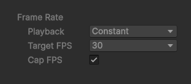
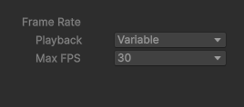

# Recording session properties

Use the Recording session properties to synchronously start or stop recordings for all active Recorders in the Recorder List (listed in the [Recorder window](RecordingRecorderWindow.md)). You can specify the recording duration and frame rate.

>[!NOTE]
>See [how to set up, start, and stop a recording session with the Recorder window](get-started-recorder-window.md).

## Recording controls

| Property | Function |
| :--- | :--- |
| **(Record Button)** | Starts or stops a recording session. |
| **Start Recording**/ **Stop Recording** | This button has exactly the same function and behavior as the Record Button mentioned above. |
| **Exit Play Mode** | When you enable this option, the Recorder automatically exits Play mode when it finishes recording. |

## Recording mode and options

| Property || Function |
|:---|:---|:---|
| **Recording Mode** || Allows you to specify the frames or time interval to record. |
||_Manual_ | Start or stop recording when you manually click **Start Recording** or **Stop Recording**, respectively. |
|| _Single Frame_ | Record a single frame. Use the **Target Frame** property to specify this frame. |
|| _Frame Interval_ | Record a set of consecutive frames during Play mode. Use the **Start** and **End** properties to specify when to start and stop.  **Important**: if you set **Start** to a value greater than zero, the Editor still plays all the frames from the beginning when entering Play Mode before starting to record the specified frame range. The Editor needs to compute and render all these frames to ensure determinism, for example when the playback involves physics simulation or procedural noise. Notice the _skipped frames_ mention during the playback of the non-recorded frames. |
|| _Time Interval_ | Record a specific duration, in seconds, during Play mode. Use the **Start** and **End** properties to specify when to start and stop. |
| **Target Frame** || Specifies the number of the frame to capture when in **Single Frame** mode. |
| **Start**/   **End** || <li> In **Frame Interval** mode, these values specify the range of frames to capture. <li> In **Time Interval** mode, these values specify the time, in seconds, to start and stop recording. |

## Frame Rate properties

Use the **Frame Rate** properties to specify how to constrain the frame rate during recording.

The Frame Rate properties determine the number of frames recorded, which affects the size of a movie file or the number of the files in an image sequence that Recorder outputs.

| Property || Function |
| :--- | :--- | :--- |
| **Playback** || Select a playback mode to control the frame rate during recording. This property affects the timing of the frames when you play back the file generated by the recording. |
|| _Constant_ | Limits the Recorder to a specific frame rate. Use the **Target FPS** property to specify this rate. Refer to [Constant Playback properties](#constant-playback-properties) for more details. |
|| _Variable_ | Reproduces the irregular time intervals between frames that occur when rendering in Game view. Specify the upper limit of the application's rate during recording with the **Max FPS** property. Refer to [Variable Playback properties](#variable-playback-properties) for more details. |

#### Constant Playback properties

Set **Frame Rate** to **Constant** to apply the same time interval between each recorded frame without regard to the time required to render the frame. You should typically use constant frame rate to record non-interactive content.

| Property | Function |
| :--- | :--- |
| **Target FPS** | Sets a constant value for the recording frame rate. |
| **Cap FPS** |  Caps the Game view's frame rate to the **Target FPS** value. It is recommended to leave this property enabled in most cases to get the expected results. |

#### Variable Playback properties

Set **Frame Rate** to **Variable** to capture frames at the rate that Play mode renders them in the Game view, where the duration of individual frames can vary.

A video player that supports variable frame rate displays each frame for the time interval associated with it in the recording. If rendering time increases during recording, the resulting frames are held longer during the playback of the recorded frames. The action can vary from slow and choppy to smooth and fast. You should typically use variable frame rate to record game play.

| Property | Function |
| :--- | :--- |
| **Max FPS** | Sets a maximum value for the recording frame rate, therefore defining a minimum frame duration. Recorder slows down updates in the Game view to stay within the specified frame rate. |

>[!NOTE]
>* The ProRes encoder does not support variable frame rate recording.
>* To record using variable frame rate, you must use the Recorder window. Variable frame rate is not available in Recorder Clips in Timeline.
