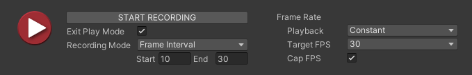

# Recording session properties

Use the Recording session properties to simultaneously start or stop recordings for all active Recorders in the Recorder List (listed in the [Recorder window](RecordingRecorderWindow.md)). You can specify the recording duration and frame rate.

>[!NOTE]
>See [how to set up, start, and stop a recording session with the Recorder window](get-started-recorder-window.md).

## Recording controls

| Property | Function |
| :--- | :--- |
| **(Record Button)** | Starts or stops a recording session. |
| **Start Recording**/ **Stop Recording** | This button has exactly the same function and behavior as the Record Button mentioned above. |
| **Exit Play Mode** | When you enable this option, the Recorder automatically exits Play mode when it finishes recording. |

## Recording mode and options

| Property || Function |
|:---|:---|:---|
| **Recording Mode** || Allows you to specify the frames or time interval to record. |
||_Manual_ | Start or stop recording when you manually click **Start Recording** or **Stop Recording**, respectively. |
|| _Single Frame_ | Record a single frame. Use the **Target Frame** property to specify this frame. |
|| _Frame Interval_ | Record a set of consecutive frames during Play mode. Use the **Start** and **End** properties to specify when to start and stop. |
|| _Time Interval_ | Record a specific duration, in seconds, during Play mode. Use the **Start** and **End** properties to specify when to start and stop. |
| **Target Frame** || Specifies the number of the frame to capture when in **Single Frame** mode. |
| **Start**/   **End** || • In **Frame Interval** mode, these values specify the range of frames to capture. • In **Time Interval** mode, these values specify the time, in seconds, to start and stop recording. |

## Frame Rate properties

Use the **Frame Rate** properties to specify how to constrain the frame rate during recording.

The Frame Rate properties determine the number of frames recorded, which affects the size of a movie file or the number of the files in an image sequence that Recorder outputs.

| Property || Function |
| :--- | :--- | :--- |
| **Playback** || Specifies how to control the frame rate during recording. |
|| _Constant_ | Limits the Recorder to a specific frame rate. Use the **Target** property to specify this rate. |
|| _Variable_ | Reproduces the irregular time intervals between frames that occur when rendering in Game view. Specify the upper limit of the application's rate during recording with the **Max FPS** property. |
| **Target FPS** || Sets the frame rate to capture the recording at. This property appears when you set **Playback** to **Constant**.    The Recorder captures at this rate regardless of whether you run your application at a higher or lower frame rate. For example, if you set **Target FPS** to a custom value of 30 fps but you run your application at 60 fps, the Recorder captures at 30 fps. |
| **Max FPS** || Sets the minimum duration for a frame, therefore limiting FPS. Recorder slows down updates in the Game view to stay within the specified frame rate.  This property is available when **Playback** is **Variable**. |
| **Cap FPS** || Enable this property when the frame rate of your application is faster than the **Target FPS**. This property is available when **Playback** is **Constant**. |

### Constant versus variable frame rate

**Constant** and **Variable** playback properties affect the timing of the frames when the file generated by the recording is played back.

* When **Constant** is selected, Recorder applies the same time interval between each recorded frame without regard to the time required to render the frame.

  Constant frame rate is typically used for recording non-interactive content.

* When **Variable** is selected, Recorder captures frames at the rate at which they are rendered during Play mode in the Game view. The duration of individual frames can vary.

  A video player that supports variable frame rate displays each frame for the time interval associated with it in the recording. If rendering time increases during recording, the resulting frames are held longer during the playback of the recorded frames. The action can vary from slow and choppy to smooth and fast.

  Variable frame rate is typically used to record game play.

>[!NOTE]
>* The ProRes encoder does not support variable frame rate recording.
>* To record using variable frame rate, you must use the Recorder window. Variable frame rate is not available in Recorder Clips in Timeline.
