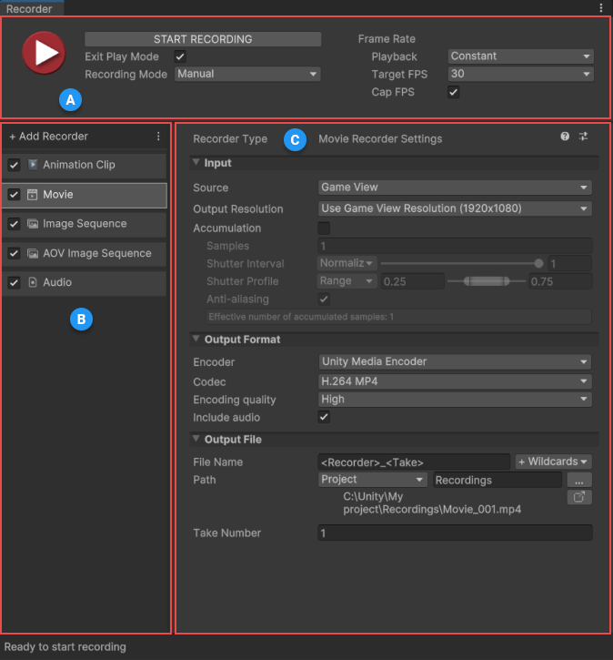

# Recorder window interface

The Recorder window allows you to set up a list of Recorders to capture and export various types of data from your current Scene, in Play mode. This window includes recording controls that allow you to start and stop your recordings according to a specified frame or time interval, or manually.

To open the Recorder window, from the Unity Editor main menu, select **Window > General > Recorder > Recorder window**.

When you open the **Recorder** window, Unity restores the values from the last recording session.

## Recorder window layout

###  Recording session properties

Use this section to [start and stop recordings](RecorderWindowRecordingProperties.md) for all active Recorders in the Recorder List. You can specify the recording duration and frame rate.

###  Recorder list

Use this section to [create and manage your list of Recorders](RecorderManage.md). You can use more than one Recorder at the same time to capture Play mode data. Each Recorder controls a single recording, and its properties depend on the type of data to record and the type of output to generate.

###  Recorder properties

Use this section to [set up the properties of a Recorder](RecorderProperties.md) selected in the Recorder list. Recorder properties include **Input**, **Output Format** and **Output File**. The set of displayed properties depends on the selected recorder type.
