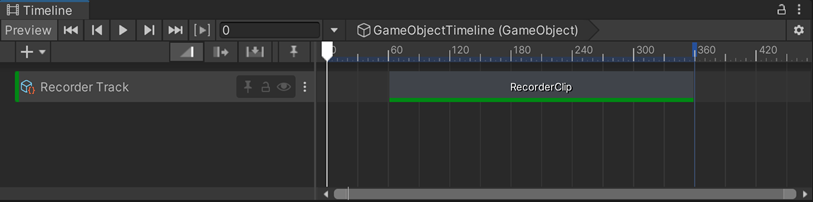
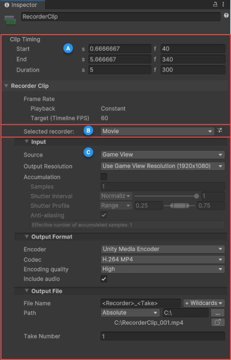

# Timeline Recorder Track and Clip interface

Recorder Tracks in Timeline allow you to create Recorder Clips that automatically activate recordings at specific time or frame intervals of the Timeline in Play mode.

## Recorder Tracks and Recorder Clips

To set up a recording in Timeline, you must add at least one **Recorder Track** with at least one **Recorder Clip** in it.

>[!NOTE]
>See [how to set up, start, and stop a recording via a Recorder Track](get-started-timeline-track.md).

## Recorder Clip properties

###  General recording properties

The Recorder Clip's **Clip Timing** properties control the recording's **Start**, **End**, and **Duration**.

>[!NOTE]
>The **Frame Rate Playback** property is locked to **Constant** mode, because Timeline plays back at a constant frame rate. Also, the Recorder Clip inherits its **Frame Rate Target** setting from the Timeline’s **Frame Rate** setting.

###  Recorder selection

Select the type of Recorder you want the Recorder Clip to use.
 You can also load any existing Recorder Preset, or save the current Recorder Clip settings as a Preset.

###  Recorder properties

Use this section to [set up the properties of the selected Recorder](RecorderProperties.md).
 Recorder properties include **Input**, **Output Format** and **Output File** properties.
