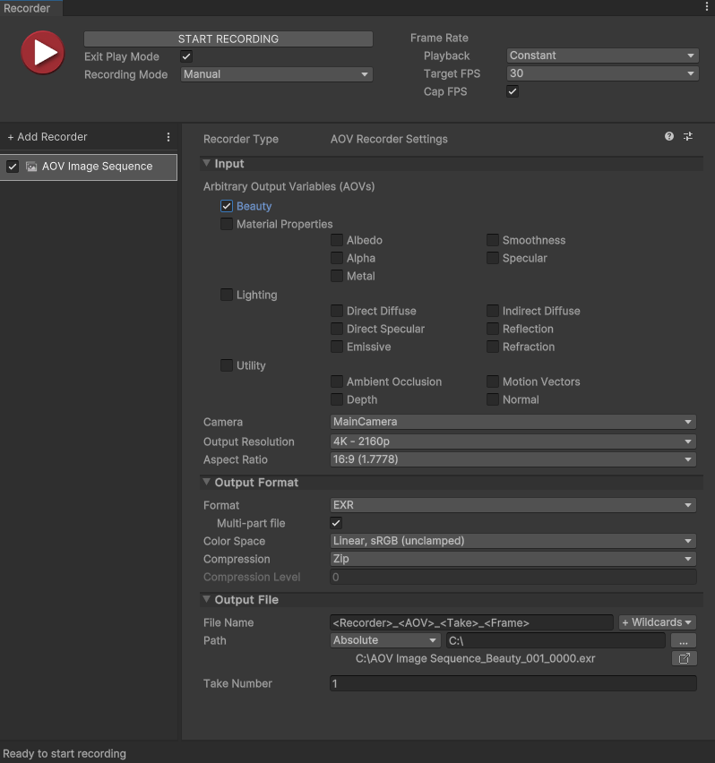

# AOV Image Sequence Recorder properties

Use the AOV Image Sequence Recorder properties to select one or multiple [Arbitrary Output Variables (AOVs) to export](aov-concepts.md), choose a source camera, and configure how the AOV passes are recorded and saved.

 _AOV Image Sequence Recorder properties in the Recorder window context._

## Input

Use this section to define the source of your recording. It includes settings to select the [AOVs to export](#arbitrary-output-variables-aovs), choose the [source camera](#camera) to use for the recording, and adjust other properties of the [output resolution](#output-resolution).

### Arbitrary Output Variables (AOVs)

Select the AOVs to record according to your needs.

>[!TIP]
>Review the [list of use case examples](aov-concepts.md#use-case-examples) to get some more perspective and help you make your selection.

The following sections describe the exportable AOVs grouped in categories, including the type of data recorded in each frame and the meaning behind the value of a single pixel for each specific AOV.

#### Beauty

| AOV | Recorded data | Pixel value |
|:---|:---|:---|
| **Beauty** | The final rendered view after post-process. | RGB color. |

#### Material Properties

Common inherent material properties of the surfaces in view. This includes data from material values or material maps.

| AOV | Recorded data | Pixel value |
|:---|:---|:---|
| **Albedo** | The overall perceived colors of the surfaces in view, with no lighting calculation and no shadows. | RGB color. |
| **Alpha** | The opacity of the surfaces in view. | Grayscale:<li>  Black (value of 0) = transparent<li> White (value of 1) = opaque |
| **Metal** | The metallic aspect of the surfaces in view. | Grayscale:<li>  Black (value of 0) = non-metal<li>  White (value of 1) = metal |
| **Smoothness** | The smoothness of the surfaces in view. | Grayscale:<li>  Black (value of 0) = rough<li>  White (value of 1) = glossy |
| **Specular** | The specular colors of the surfaces in view. | RGB color. |

#### Lighting

All lighting modes that contribute to the Beauty. These specific AOVs are for light decomposition purposes. The recorded data depends on the current lighting of the Scene and on the surface materials, and includes shadows.

| AOV | Recorded data | Pixel value |
|:---|:---|:---|
|**Direct Diffuse**|The direct diffuse light response of the surfaces in view. | RGB color. |
|**Direct Specular**|The direct specular light response of the surfaces in view.|RGB color. |
|**Emissive**|The light emitted by the surfaces in view.|RGB color. |
|**Indirect Diffuse**|The indirect diffuse light response of the surfaces in view.|RGB color.|
|**Reflection**|The light reflected by the surfaces in view.|RGB color.|
|**Refraction**|The light refracted by the surfaces in view.|RGB color.|

#### Utility

Various data computed from the Scene.

| AOV | Recorded data | Pixel value |
|:---|:---|:---|
|**Ambient Occlusion**|The data resulting from ambient occlusion post-process of the Scene.| Grayscale:<li> Black (value of 0) = fully occluded<li> White (value of 1) = not occluded |
|**Depth**|The relative distances of the Scene elements in view between the Far Plane and the Near Plane of the recording Camera.|Grayscale:<li> Black (value of 0) = at Far Plane<li> White (value of 1) = at Near Plane |
|**Motion Vectors**|The 2D vectors representing the movements in the Scene relative to the recording Camera.|R and G channels only:<li> The values of the R and G channels respectively represent the horizontal and vertical coordinates of the vectors in the image plane.<li> The range of values is between -1 and 1, normalized to the **Output Resolution** you selected for the recording. |
|**Normal**|The data resulting from geometric normals and normal maps of the surfaces in view.|R, G and B channels: The values of the R,G,B channels respectively represent the X,Y,Z vector coordinates of the normals in World Space. |

### Camera

Select the camera to use for the recording.

| Property || Function |
|:---|:---|:---|
| **Camera** || Specifies which camera the Recorder uses to capture the AOV recording.  **Note:** [You can't set the Camera property to ActiveCamera](KnownIssues.md#activecamera-recording-not-available-with-srps) due to a High Definition Render Pipeline (HDRP) limitation. |
|| MainCamera | The Camera tagged with the MainCamera [Tag](https://docs.unity3d.com/Manual/Tags.html). |
|| TaggedCamera | A camera tagged with a specific [Tag](https://docs.unity3d.com/Manual/Tags.html).  If you select this option, you must enter a value in the **Tag** field. |
|**Tag** || Specifies which Camera Tag to look for when you set **Camera** to **Tagged Camera**. |

### Output Resolution

Set the dimensions and other properties of the recorded view.

>[!NOTE]
>If the Output Resolution and/or Aspect Ratio in the Recorder is different than the Game view resolution, the Recorder switches the Game view to the Recorder's resolution before starting the recording. After the recording ends, the Game view does not automatically revert to its previous resolution.

| Property || Function |
|:---|:---|:---|
| **Output Resolution** || Allows you to set the dimensions of the recorded view using different methods. |
|   | Match Window Size  | Matches the resolution and aspect ratio of the currently selected Game View. |
|   | _[PRESET RESOLUTIONS]_ | Choose from several standard video resolutions such as FHD (1080p) and 4K (2160p).  The numeric value represents the image height. To set the image width, you must select a specific **Aspect Ratio**. |
|   |  Custom | Uses custom width and height values that you supply in the **W** and **H** fields. |
| **Aspect Ratio** || Specifies the ratio of width to height (w:h) of the recorded view when you set the **Output Resolution** to a preset resolution. |
|   | _[PRESET ASPECT RATIOS]_ | Choose from several standard aspect ratios such as 16:9 (1.7778) and 4:3 (1.3333). |
|   | Custom   | Uses custom aspect ratio that you supply in the displayed fields (w:h). |
| **Render Frame Step** || Available when you set **Playback** to **Variable**. Specifies the number of rendered frames to discard between recorded frames. Example: if the value is 2, every second frame is discarded. |

## Output Format

Use this section to set up the media format you want to save the recorded images in.

| Property | | Function |
|:---|:---|:---|
| **Format** | | The file encoding format.  Choose **PNG** or **EXR** ([OpenEXR](https://en.wikipedia.org/wiki/OpenEXR)). The Recorder encodes EXR in 16 bits. Note that a single EXR file can include multiple AOVs.|
||**Multi-part file**|Export all selected AOVs to a single multi-part file instead of exporting each AOV to a separate file. This only applies to EXR files.|
| **Color Space** | | The color space (gamma curve and gamut) to use in the output images. |
|  | sRGB, sRGB | Uses sRGB curve and sRGB primaries. |
|  | Linear, sRGB (unclamped) | Uses linear curve and sRGB primaries. This option is only available when you set the **Format** to **EXR**.  **Important:** To get the expected unclamped values in the output images, you must:<ul><li> Disable any Tonemapping post-processing effects in your Scene (menu: **Edit > Project Settings > HDRP Default Settings** and deselect **Tonemapping**) and in any Volume that includes a Tonemapping override (select the Volume, navigate in the Inspector and deselect **Tonemapping** if present).<li> Disable **Dithering** on the Camera selected for the capture (in the Inspector, navigate to **General** and deselect **Dithering**).</ul> |
| **Compression** | | The [EXR compression method](https://en.wikipedia.org/wiki/OpenEXR#Compression_methods) to apply when saving the data. This property is only available when you set the **Format** to **EXR**.<li> Available _lossless_ compression types: **RLE**, **Zip** (default), **Zips**, **PIZ**.<li> Available _lossy_ compression types: **B44**, **B44a**, **DWAA**, **DWAB**.<li> Choose **None** to disable compression. |
| **Compression Level** |  | Adjustable compression level for DWAA and DWAB compression types. Higher values reduce the file size but introduce increasing color distortion. |

## Output File

Use this section to specify the output **Path** and **File Name** pattern to save the recorded image files.

>[!NOTE]
>[Output File properties](https://docs.unity3d.com/Packages/com.unity.recorder@latest/index.html?subfolder=/manual/OutputFileProperties.html) work the same for all types of recorders.
