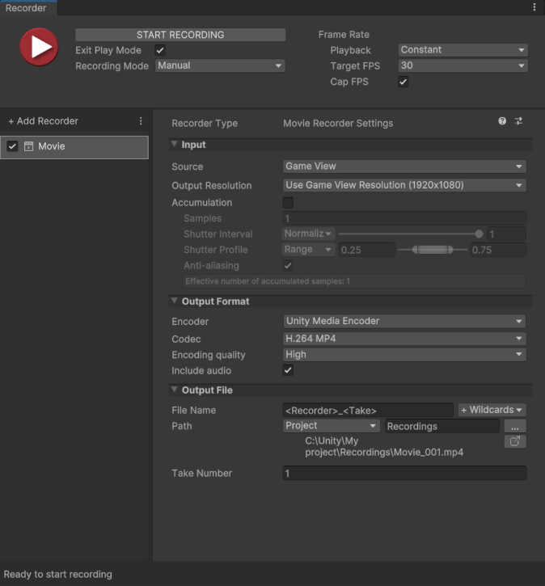

# Record via a centralized recording session

Set up a centralized recording session with one or multiple recorders to perform simultaneous recordings within a single time or frame interval in Play mode.

This workflow implies the use of the [Recorder window](RecordingRecorderWindow.md).

## Set up a recording session

1. Open the Recorder window: select **Window** > **General** > **Recorder** > **Recorder Window**.

2. At the top of the Recorder window, configure the [recorder session properties](RecorderWindowRecordingProperties.md) to specify the time or frame interval to record.

3. In the left pane of the Recorder window, add a new recorder: select **Add Recorder**, and then select the type of recorder you want to set up.

    
   _Example: Recorder window with Movie Recorder added in Recorder list._

## Set up the recorder properties

1. In the Recorder list, select the added recorder (if not already selected).

2. In the right pane, configure the **Input** and **Output Format** properties to specify what you want to capture and how you want to record it according to the [Recorder type](RecorderProperties.md) you added.

3. Configure the [**Output File** properties](OutputFileProperties.md) to specify the name, path, and other data for the files the Recorder outputs.

## Set up additional Recorders (if needed)

You can add and configure other Recorders in the [Recorder list](RecorderManage.md) to set up simultaneous recordings within the same time or frame interval.

## Start the recording session

When you use the Recorder window, you must always start the recording manually. When you start a recording, the Editor automatically enters Play mode (if it is not already running) and starts to capture the targeted data using all active Recorders.

To start recording, you can do any of the following:
  - In the Recorder window, select the Record button or the **START RECORDING** button.
  - Press **F10**/**fn+F10**.
  - From the main menu, select **Window > General > Recorder > Quick Recording**.

>[!NOTE]
>* During recording, you cannot modify the properties in the Recorder window.
>* Only Mono or Stereo audio recording is supported. If a non-supported speaker mode is selected in **Project Settings** > **Audio** > **Default Speaker Mode**, Recorders that include audio cannot start.
>* If your recording includes audio, the audio signal is sent to the Recorder, not to your system's audio output.

## Stop the recording session

Most **Recording Mode** settings stop the recording automatically, although you can manually stop it before it finishes. If you set **Recording Mode** to **Manual**, you must stop the recording yourself.

To stop recording, you can do any of the following:
  - In the Recorder window, select the Record button or the **STOP RECORDING** button.
  - Use the **F10**/**fn+F10** shortcut.
  - Close the Recorder window.
  - Exit Play mode.

>[!NOTE]
>When the recording stops, the Editor remains in Play mode unless you enable the **Exit Play Mode** property.

## Get the recording output

The Recorder saves the file(s) in the folder specified in **Output File** > **Path** for each Recorder of the Recorder list.
