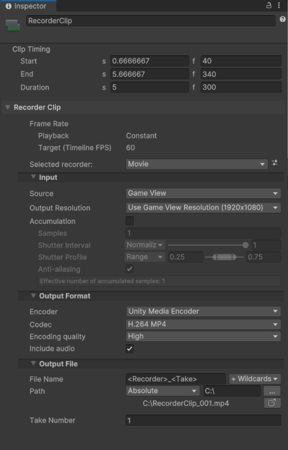

# Trigger recordings from Timeline

Trigger independent recordings from a Timeline Track at multiple time or frame intervals in Play mode.

This workflow implies the use of [Recorder Tracks and Clips](RecordingTimelineTrack.md) in [Timeline](https://docs.unity3d.com/Packages/com.unity.timeline@latest).

## Set up a Recorder Track with a Recorder Clip

1. Open Timeline where you want to set up the Recorder Track.

2. In the Timeline window, click on the Add (**+**) button and select **UnityEditor.Recorder.Timeline** > **Recorder Track**.

3. Right-click in the **Recorder Track** you just added and select **Add Recorder Clip**.

   

4. Adjust the clip timing according to the time or frame interval you need to record.

## Set up the recorder properties

1. In Timeline, select the added **Recorder Clip** (if not already selected).

2. In the Inspector, in the **Selected recorder** dropdown list, select the type of recorder you want to set up.

   

3. Configure the **Input** and **Output Format** properties to specify what you want to capture and how you want to record it according to the [Recorder type](RecorderProperties.md) you added.

4. Configure the [**Output File** properties](OutputFileProperties.md) to specify the name, path, and other data for the files the Recorder outputs.

## Set up additional Recorder Clips (if needed)

You can add and configure as many additional Recorder tracks and Recorder Clips as you need in your Timeline to have them automatically activated and stopped at different intervals in Play mode.

## Start and stop the recording

When you set up a Recorder Clip, you must enter Play mode to eventually get the expected recording.

Once in Play mode:

* The recording automatically starts when the Timeline plays the Recorder Clip, according to the **Start** setting value of the clip.

* The recording automatically stops when the Recorder Clip reaches its **End** setting value or if you manually stop the Timeline.

## Get the recording output

The Recorder saves the file(s) in the folder specified in **Output File** > **Path** for each Recorder Clip.

## Additional resources

* [Timeline package documentation](https://docs.unity3d.com/Packages/com.unity.timeline@latest)
