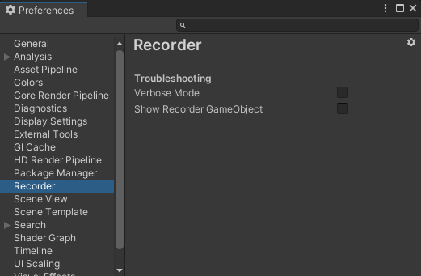

# Recorder preferences

Recorder preferences are located in the Unity Editor's [Preferences window](https://docs.unity3d.com/Manual/Preferences.html).

From the Unity Editor main menu, select **Edit > Preferences**, an then in the Preferences window, in the left pane, select **Recorder**.

## Properties

| Property | Description |
|:---|:---|
| **Verbose Mode** | Enable [Verbose Mode](RecorderDebugging.md#recording-in-verbose-mode) to get diagnostic information through the Console during your recordings, for troubleshooting purposes. |
| **Show Recorder GameObject** | Enable this option to make the temporary [Recorder GameObjects](RecorderDebugging.md#recorder-gameobjects) visible in the Hierarchy during your recordings, for troubleshooting purposes. |
