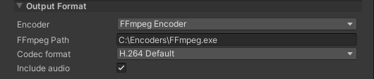

# Custom Encoder: FFmpeg

This sample provides an example for integrating a custom command line encoder such as FFmpeg in the [Movie Recorder](RecorderMovie.md).

## Requirements

To use this sample, you must provide your own FFmpeg executable.
>**Note:** For reference, Unity tested the functionality of this sample with FFmpeg 5.0.1.

## Getting the sample

To get the sample:

1. Open the Package Manager and select the **Recorder** package in the list.

2. In the right pane, expand the **Samples** section, and then next to **Custom Encoder: FFmpeg**, click on **Import**.

## Setting up the FFmpeg encoder

To set up a Movie Recorder to encode using your FFmpeg executable:

1. Open the [Recorder window](RecordingRecorderWindow.md), and then from the [Recorder List](RecorderManage.md), add a **Movie Recorder**.

2. In the [Movie Recorder Settings](RecorderMovie.md), in the **Output Format** section, set the **Encoder** to "FFmpeg Encoder".

3. Specify the **FFmpeg Path** to allow Unity to use your FFmpeg executable for the encoding.

  
